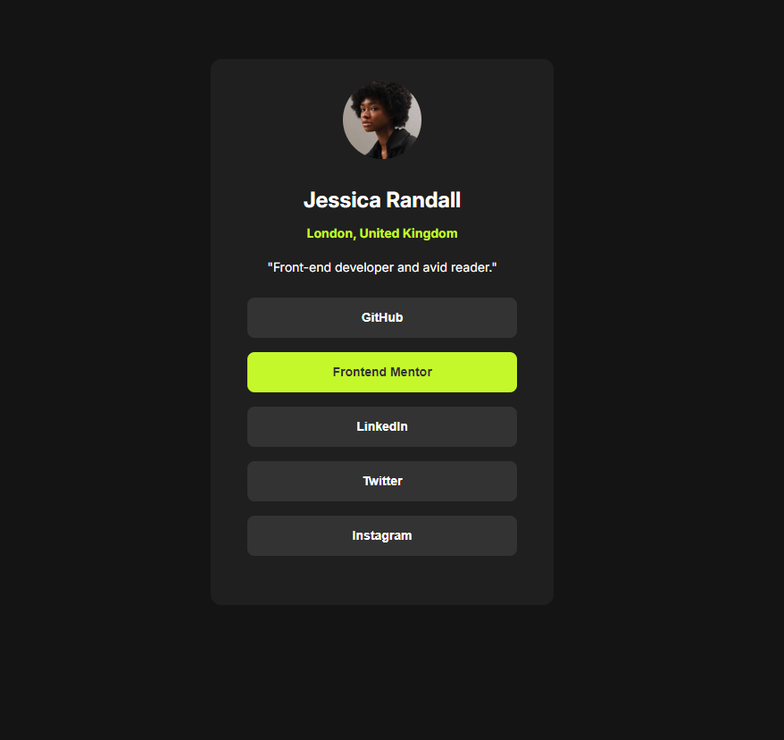

# Frontend Mentor - Social links profile solution

This is a solution to the [Social links profile challenge on Frontend Mentor](https://www.frontendmentor.io/challenges/social-links-profile-UG32l9m6dQ). Frontend Mentor challenges help you improve your coding skills by building realistic projects. 

## Table of contents

- [Overview](#overview)
  - [The challenge](#the-challenge)
  - [Screenshot](#screenshot)
  - [Links](#links)
- [My process](#my-process)
  - [Built with](#built-with)
  - [Continued development](#continued-development)
- [Author](#author)

**Note: Delete this note and update the table of contents based on what sections you keep.**

## Overview

### The challenge

Users should be able to:

- See hover and focus states for all interactive elements on the page

### Screenshot

### Links

- Solution URL: https://github.com/gianmromero/social-links-profile-main/tree/master
- Live Site URL: https://gianmromero.github.io/social-links-profile-main/

## My process

### Built with

- CSS custom properties
- Flexbox
- Mobile-first workflow

### Continued development

I want to learn how stop using negative margins and align the elements better.

## Author
- Frontend Mentor - [@gianmromero](https://www.frontendmentor.io/profile/gianmromero)

